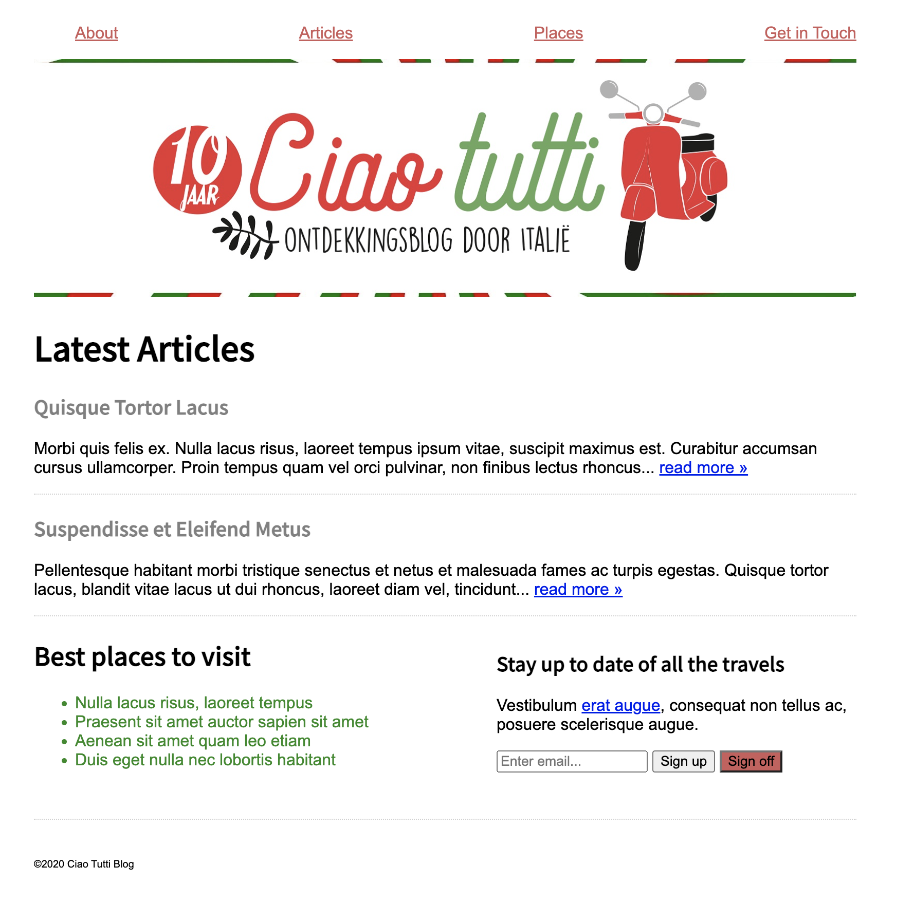

# Opdrachtbeschrijving

De styling van de webpagina Ciao Tutti is nog niet helemaal af. Daarom is het aan jou om de puntjes op de i te zetten. Je zult in deze opdracht gebruik moeten maken van type- class- en id selectors, maar ook van combinators en pseudo-classes.

Je kunt deze opdracht maken door het project te clonen of te downloaden naar jouw eigen computer via deze GitHub repository. De uitwerkingen staan op de branch _uitwerkingen_. Je kunt deze opdracht **niet** maken door alleen de HTML naar jouw eigen project te kopiëren.

Het project bevat de volgende bestanden:
* `index.html` met daarin de content van de pagina. Bekijk dit eerst even goed, zodat je ziet hoe de structuur in elkaar zit.
* `styles.css`: hier vind je de instructies voor de stijlregels die je gaat aanpassen. Je kunt jouw CSS er simpelweg tussen schrijven.

## Aandachtspunten
* Denk eraan dat je alleen iets in het HTML-bestand mag veranderen wanneer dit uitdrukkelijk in de opdracht staat!
* Je hoeft niet naar `base-styles.css` te kijken: dit is enkel toegevoegd om de pagina van basis-opmaak te voorzien. Hier mag je dus niets in aanpassen en is niet relevant voor de opdracht.

## Eindresultaat

